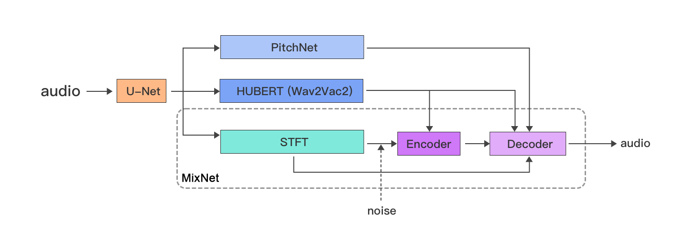

# Mix-Net

A transformer-based model for voice conversion, training with a few data (about 1min low noise speech), few training data, small training epoch, better result.  

> The online experience, [See the site here](https://lamucal.com/ai-cover) 

   

This model begins by processing the audio signal with a `UNet`, which isolates the vocal track. 
The vocal track is then analyzed by `PitchNet` to extract pitch features. `PitchNet` is a specialized 
residual network designed for pitch extraction. Simultaneously, `HuBERT` is used to 
capture detailed features of the vocal track. The model also introduces noise through STFT transformation, 
which is combined with the extracted features and passed to `MixNet`. `MixNet`, based on a Transformer 
architecture with an encoder and decoder, is trained to generate a mask used to extract and replace the 
timbre of the audio, ultimately producing the final output audio.

The entire AI-powered process is implemented in `mix.py`, while the various network structure 
models can be referenced in the `models` folder.   

## Demo
The results of training on a 1-minute speech of Donald Trump are as follows: 

<table>
<tr>
<td align="center">
  
**Train 10 epoch(Hozier's Too Sweet)**
  
</td>
<td align="center">
  
**Train 100 epoch(Hozier's Too Sweet)**
  
</td>
</tr>
<tr>
<td align="center">

[Train 10 epoch.webm](https://github.com/user-attachments/assets/992747d6-3e47-442c-ab63-0742c83933ee)

</td>
<td align="center">

[Train 100 epoch.webm](https://github.com/user-attachments/assets/877d2cae-d7b7-4355-807f-424ada7df3a1)

</td>
</tr>
</table>

You can experience creating your own voice online, [See the site here](https://lamucal.com/ai-cover)
